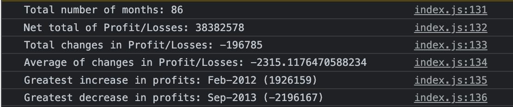

# console-finances

## Description

This Javascript code iterates a large nested array and uses a for loop to find and print:
* Total amount of months
* Net total of the amounts
* Average change in amounts between each month
* The months with the greatest increase and decrease in amounts

## Installation

To view the page visit [fawltya.github.io/console-finances](https://fawltya.github.io/console-finances/)

## Usage

Inspect the console log to view the results.

## License

MIT License

---
